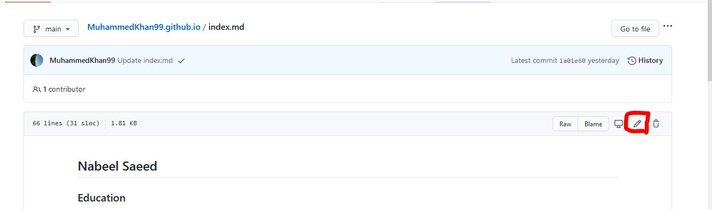
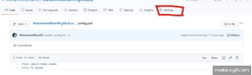
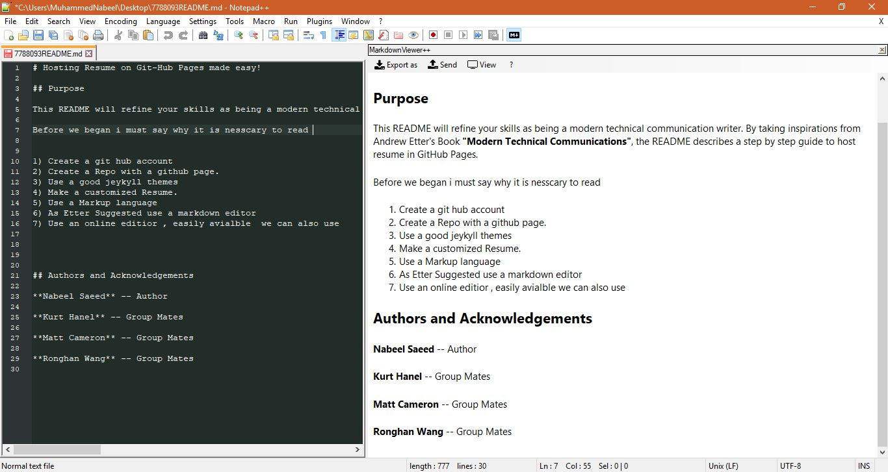

# Hosting Resume on Git-Hub Pages made easy!

## Purpose

This README will refine your skills as being a modern technical communication writer. By taking inspirations from Andrew Etter's Book **"Modern Technical Communications"**, the README describes a step by step guide to host resume in GitHub Pages.

## Prerequisites

#### 1) A Resume.
- A resume that is beautifully formatted in markdown. Since this tutorial tells you how to host a resume on GitHubPages, using markdown will be much easier than any other word processor.

#### 2) Mark Down Editor.
- You have alot of choices for this pre-requiste since there are many markdown editors, some are online and some are free available. I prefer using Notepad++, it has a very simple and effectice plugin that can easily be downloaded and installed. The plugin has an option to view realtime changes you make to the document , when you use markdown formatting.
- Please click on this [link](#more-steps) if you need more help to download and install this plugin.

#### 3) A GitHub account .
- You also would need to make a github account. 
- Goto [GitHub](www.github.com) to make you account.

## Instructions

### Goal

The goal of this resume as indicated in the purpose section is to help you into hosting your resume succefully on GitHubPages. But would also take into account some of the many suggestions _Andrew Etter_ has prescribed in his book **Modern Technical Writing**.

#### Step 1 Create a GitHub Repo:
- Log into you github account and make a new repository.
- For you to host the resume on GitHubPages you must name your Repo _**username.github.io**_.
- Check if your Githubpage is working by copying and pasting your repo name in an empty tab of the browser.

##### We are doing this step because Etter in his book _Modern Technical Writing_ tells us that using a static website, is much better than a PDF or .docx file. Mainly because PDF and word files are downloaded and forgotten by the users. While Static websites can be refreshed and renewed. Hosting your resume on a static website will not only tell that you are familair with git hub and all its resources but also help you revise quickly any changes on your resume but also keeping it live.

#### Step 2 Display your Resume :
- Make a file named index.md in your repo.This is going to be the very first page shown on your static website.
- Open your favourite Mark Down editor and format your resume.
- Copy and paste your formatted resume to the index.md file like shown in the picture below:

- After following  the step above you would be able to see your resume displayed on your webpage.

##### We are doing this step because Etter in his book _Modern Technical Writing_ suggested that using a static website is efficient, portable and most of all very easy.  

#### Step 3 Make a Title and Spice it up :

- To create a title you would need to create a yaml configuration file.
- Add a new file _config.yml.
- Put a title in the _config.yml file : by typing tittle : YOUR Tittle.
- Select a theme for your GitHubPages. Follow the GIF below to change your theme.

#### We are doing this setup because the static website that you have generated is using [Jekyll](https://jekyllrb.com/) that helps transform your markdown into a static website. It uses YAML a data serialization language to make your staic website more customizable. That is why we need YAML config file to change the title and the theme of the static website.

#### Step 4 End Result

## More Resources

- [Github Starter Guide](https://guides.github.com/activities/hello-world/).
- [Markdown Tutorial](https://www.markdowntutorial.com/).
- [_Modern Technical Writing_ by **Andrew Etter**](https://www.amazon.ca/Modern-Technical-Writing-Introduction-Documentation-ebook/dp/B01A2QL9SS).

## More Steps

- Open NotePad++.

- Goto Plugins and open the dropdown.

- Click on plugins Admin option.

- Search for MarkDown Viewer in the plugin choice window.

- Check the tick mark on MarkDown Viewer++ and click install.

- Press Control+Shift+m to view markdown Viewer++ window just as shown in the picture below.

## Authors and Acknowledgements

**Nabeel Saeed** -- Author

**Kurt Hanel** -- Group Mates

**Matt Cameron** -- Group Mates

**Ronghan Wang** -- Group Mates

** Andrew Etter** -- Author of *Modern Technical Writing*

** Parker Moore** -- Creator of Cayman Theme.
